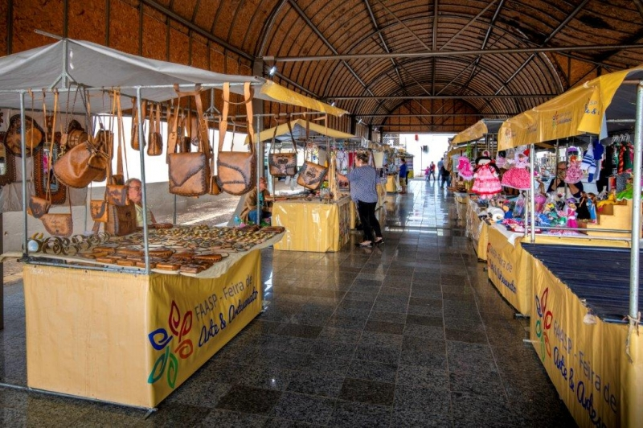
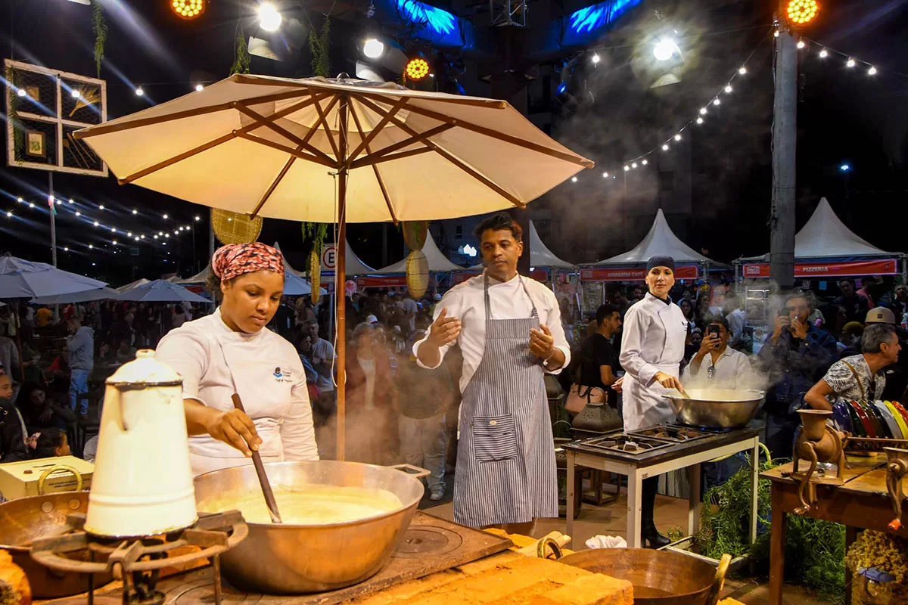

# 🎉 Eventos em Araraquara

Este projeto é um **site estático** desenvolvido com **HTML e CSS**, com o objetivo de divulgar eventos que acontecem na cidade de **Araraquara (SP)**.

O site apresenta uma navegação simples e intuitiva, reunindo informações sobre eventos culturais, gastronômicos e de lazer, além de um **calendário mensal**, um **manual de sobrevivência para visitantes** e uma **página de contato**.

---


## 🎯 Objetivo do Projeto

Este projeto foi desenvolvido com fins **educacionais**, para praticar:

* Estruturação de páginas HTML
* Organização de layouts com CSS
* Criação de sites informativos
* Boas práticas de organização de repositórios no GitHub

---

## 🌐 Visão Geral

O site é composto por páginas interligadas através de um menu lateral fixo, permitindo ao usuário:

* Visualizar eventos disponíveis na cidade
* Conferir datas, locais e preços
* Acessar um guia com dicas úteis para visitantes
* Entrar em contato para mais informações

---

## 📄 Páginas do Projeto

* **Página Principal (`index.html`)**
  Apresentação do site e introdução aos eventos da cidade.

* **Calendário de Eventos (`calendario.html`)**
  Lista de eventos organizados por data, com informações de local e preço.

* **Manual de Sobrevivência (`categorias.html`)**
  Dicas de segurança, links úteis (mapa da cidade e previsão do tempo).

* **Contato (`contato.html`)**
  Formulário simples para envio de mensagens.

---

## 📸 Capturas de Tela do Projeto

Abaixo estão algumas imagens ilustrativas do site **Eventos em Araraquara**, mostrando diferentes tipos de eventos disponíveis na plataforma:

### 🎨 Feira de Artesanato


### 🎤 Show ao Vivo


### 🍽️ Evento Gastronômico


### 🎭 Teatro


---

## 🛠️ Tecnologias Utilizadas

* **HTML5** – Estrutura das páginas
* **CSS3** – Estilização e layout
* **Flexbox & Grid** – Organização dos elementos

> Projeto **100% front-end**, sem uso de JavaScript ou back-end.

---

## ▶️ Como Executar o Projeto

1. Clone o repositório:

   ```bash
   git clone https://github.com/seu-usuario/eventos-em-araraquara.git
   ```
2. Abra o arquivo `index.html` em qualquer navegador

Não é necessário instalar dependências.


---

## 🚀 Melhorias Futuras

* Adicionar JavaScript para filtros de eventos
* Implementar responsividade para mobile
* Integração com API de eventos
* Envio real do formulário de contato

---

## 👩‍💻 Autora

**Jeniffer Leme**
Estudante de Análise e Desenvolvimento de Sistemas

